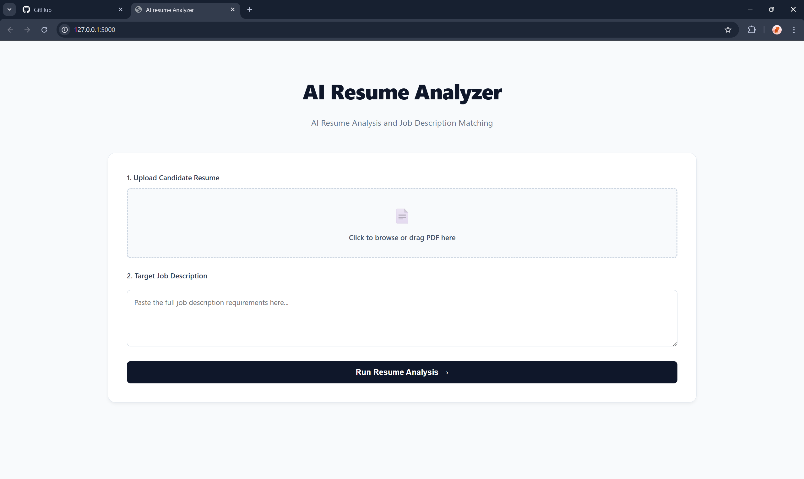
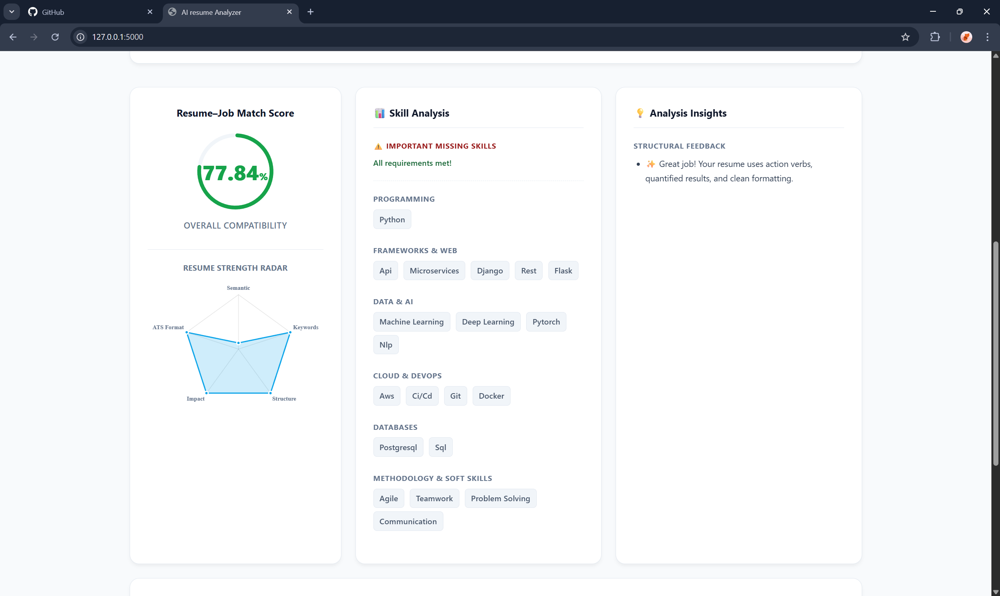
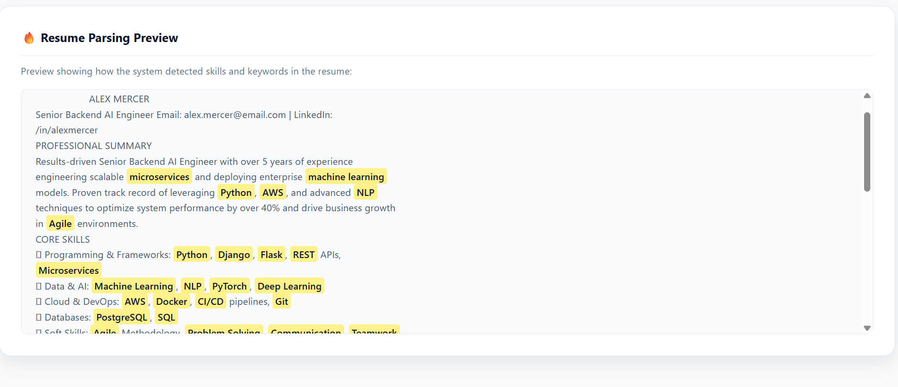

# 🚀 AI-Resume-Analyzer


An AI-powered resume analysis tool that compares candidate resumes with job descriptions using semantic similarity and NLP techniques.

---

## 🎥 Demo


---

## ⚠️ Deployment Note: Deep Learning Architecture
This project uses `SentenceTransformers` and `PyTorch` to perform localized, high-fidelity semantic similarity calculations. Because the model must be loaded into RAM during startup, this application exceeds the 512MB compute limits of standard free-tier hosting platforms. To ensure zero-latency performance and prevent out-of-memory crashes, this architecture is designed to be run locally.

---

## 🚀 Features

- **Upload PDF Resumes:** Secure file parsing and temporary storage.
- **Semantic Deep Learning Match:** Contextual similarity scoring replacing brittle keyword frequencies.
- **Multi-Dimensional Quality Radar:** Visual ATS simulation scoring across Structure, Impact, Keywords, and Formats.
- **Skill Category Intelligence:** Automatic grouping of parsed entities into domains (e.g., *Data & AI*, *Cloud & DevOps*).
- **Proactive ATS Warnings:** Detection of parser-breaking formatting (tables, columns).
- **Transparent Heatmap Verification:** Dynamic HTML document heatmap highlighting extracted entities in raw text.

---

## 🛠 Tech Stack

**Frontend**
- HTML5 / CSS3 (Custom B2B Dashboard UI)
- JavaScript
- Chart.js (Radar & Doughnut visual analytics)

**Backend**
- Python 3.12+
- Flask (Lightweight routing and controller logic)

**AI / Data Processing**
- Hugging Face `SentenceTransformers` (`all-MiniLM-L6-v2`)
- PyTorch
- `pdfplumber` (Raw text extraction)
- Regular Expressions (Regex) for structured parsing

---

## 📸 Screenshots

### 1. Clean Upload Interface


### 2. Multi-Dimensional Analytics Dashboard
*(Featuring dynamic scoring, radar charts, and categorized AI entity extraction)*


### 3. Transparent Heatmap Parsing


---

## ⚙️ How It Works

1. **Input:** User uploads a candidate resume in PDF format and pastes the target job description.
2. **Extraction:** The system safely extracts the raw text from the document using `pdfplumber`.
3. **Categorization:** The NLP engine identifies key skills and maps them into professional business and tech categories.
4. **Deep Learning:** The text is converted into high-dimensional vector embeddings via the `SentenceTransformer` model.
5. **Scoring:** The engine calculates the semantic Cosine Similarity alongside multi-factor ATS structural checks.
6. **Output:** The Flask controller renders a dynamic, interactive dashboard displaying the match score, radar chart, skill gaps, and actionable feedback.

---

## 🧠 System Architecture

This application strictly adheres to the **Model-View-Controller (MVC)** pattern to separate routing logic from heavy AI computation:

* **Engine (`analyzer.py`):** Handles PDF extraction, Regex fallbacks, and the PyTorch neural network logic. Loads the model globally to prevent memory leaks on concurrent server requests.
* **Controller (`app.py`):** A lightweight Flask router that manages secure file uploads, data unpacking, and template rendering. 
* **View (`index.html`):** A responsive, CSS Grid-powered frontend utilizing JavaScript for real-time chart rendering.

---

## 💻 Local Installation

1. Clone the repository and create a virtual environment:
   ```bash
   git clone https://github.com/AayushWaney/AI-Resume-Analyzer.git
   cd AI-Resume-Analyzer
   python -m venv venv
   source venv/bin/activate  # On Windows use `venv\Scripts\activate`
   ```
2. Install the required dependencies:
    ```bash
   pip install -r requirements.txt
   ```
3. Boot the Flask Server:
   ```bash
   python app.py
   ```
4. Access the dashboard at 
    ```bash 
   http://127.0.0.1:5000
   ```

---

## 📁 Project Structure

```text
AI-Resume-Analyzer/
│
├── app.py                  # Flask application entry point
├── analyzer.py             # Core AI analysis engine
├── requirements.txt        # Python dependencies
│
├── templates/              # HTML templates
│   └── index.html          
│
├── static/                 # CSS / JS assets
│
├── uploads/                # Temporary resume storage
│
└── screenshots/            # Images and Demo GIF used in README
```

---

## 🔮 Future Improvements
* Deploy the model using a dedicated inference API to reduce server memory usage
* Add user accounts and resume history tracking
* Support multiple resume formats (DOCX)
* Expand skill taxonomy using external datasets
* Containerize the application using Docker

---

## 👨‍💻 Author
Aayush Waney  
B.Tech – Metallurgical Engineering  
VNIT Nagpur

GitHub: https://github.com/AayushWaney

---

 ## 📄 License
This project is released for educational and portfolio purposes.

---